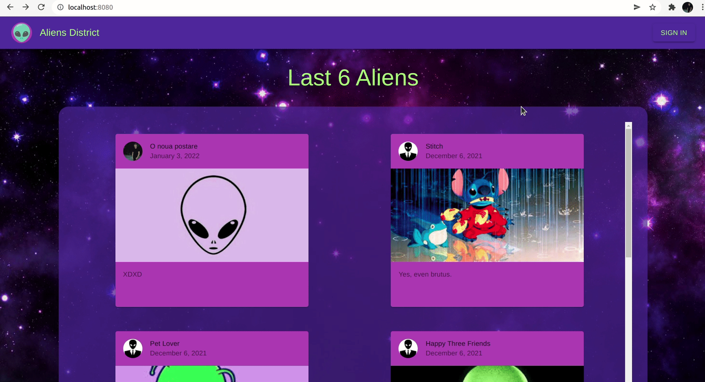

# aliens-district
👽 Another REACT project.  
👽 This time you can flex with your collection of aliens.

## Page gists:
- As a guest user you can see only last 6 aliens on **Home** page and last 4 on any other **User** page.
- As a member you can:
    - SEE every alien ever posted
    - ADD an alien to wall of fame
    - EDIT/DELETE alien post

## Project requirements: 
- Public and Private routes &#10004;
    - As a guest user you're not able to create a post (on */new-post* route) or to edit someone's else post. 
 

- Reusable Components &#10004;
    - Some notable components would be **Responsive Infinite Scroller**, **Page Wrapper** and **Card Component**.
 

- Register, Login, Profile page &#10004;
    - All above and also I created a custom hook that reflect auth state in Redux Store.
    - You can also Register/Login via Google.
 

- State Manager &#10004;
    - I used RTK(Redux Toolkit) because I always wanted to try this "new way" of redux.  
 

- Self developed API or Firebase Backend &#10004;
    - All DB actions use Firestore.
 

**BONUS:** I integrated webpack in order to hot reload Redux Store changes (saving dev time)
